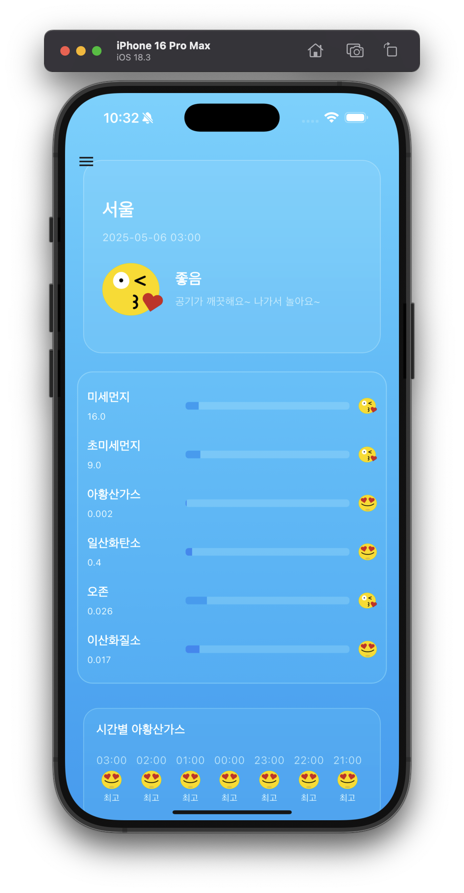

# dustify 🌬️

[](https://flutter.dev)
[](https://dart.dev)
[](https://isar.dev)
[](https://pub.dev/packages/dio)

## 📸 앱 미리보기

<p align="center">
  
  
  
</p>

## 🚀 프로젝트 기능

- 실시간 대기질 정보 제공
- 지역별 대기질 상태 표시
- 대기질 예측 정보 제공
- 사용자 맞춤 대기질 알림

대기질 정보를 제공하는 Flutter 애플리케이션입니다.

## 📋 프로젝트 요구사항

### 🎯 Flutter SDK 버전
- Flutter SDK 3.7.0 이상이 필요합니다.
- Dart SDK 3.7.0 이상이 필요합니다.

### 📦 의존성 패키지
- `dio: 5.8.0+1` - HTTP 통신
- `isar: 3.1.0+1` - 빠른 NoSQL 데이터베이스
- `isar_flutter_libs: 3.1.0+1` - Flutter용 Isar
- `path_provider: 2.1.5` - 파일 경로 제공

#### 📊 Isar에 대한 추가 정보
- Isar는 빠르고 효율적인 NoSQL 데이터베이스입니다
- Flutter 앱에서 데이터를 빠르게 저장하고 조회할 수 있습니다
- 자동 인덱싱과 쿼리 기능을 제공하여 데이터 관리가 용이합니다
- 높은 성능과 작은 크기로 알려져 있습니다

### 💻 개발 환경 설정

1. Flutter SDK 설치
   ```bash
   # Flutter SDK 다운로드
   git clone https://github.com/flutter/flutter.git
   
   # 환경 변수 설정
   export PATH=$PATH:`pwd`/flutter/bin
   ```

2. 의존성 설치
   ```bash
   flutter pub get
   ```

3. 앱 실행
   ```bash
   # Android 에뮬레이터 실행
   flutter run
   
   # iOS 시뮬레이터 실행
   flutter run -d ios
   ```

### 📱 플랫폼 지원
- Android (API 21 이상)
- iOS (iOS 11.0 이상)

## 📁 프로젝트 구조

```
lib/
├── main.dart          # 애플리케이션 진입점
├── screen/            # 화면 컴포넌트
├── component/         # 재사용 가능한 위젯
├── widget/           # 위젯 컴포넌트
├── utils/            # 유틸리티 함수
├── const/            # 상수 정의
├── model/            # 데이터 모델
└── repository/       # 데이터 저장소
```

## 📸 앱 미리보기

<p align="center">
  
  
  
</p>

## 🚀 프로젝트 기능

- 실시간 대기질 정보 제공
- 지역별 대기질 상태 표시
- 대기질 예측 정보 제공
- 사용자 맞춤 대기질 알림

