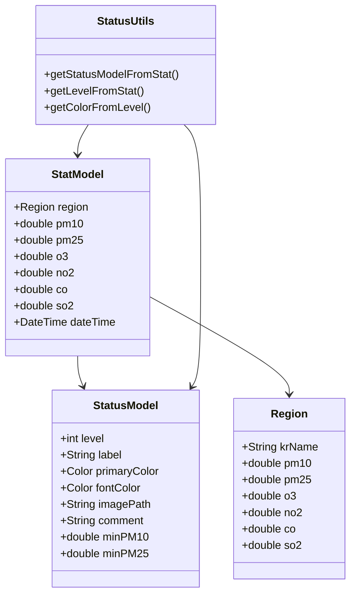

# 3. Domain Analysis

## 1. System Components

### 1) Region
- **Attributes**:
  - krName: 지역의 한글 이름
  - pm10: PM10 농도
  - pm25: PM2.5 농도
  - o3: 오존 농도
  - no2: 이산화질소 농도
  - co: 일산화탄소 농도
  - so2: 황화수소 농도

### 2) StatusModel
- **Attributes**:
  - level: 상태 레벨 (0-6)
  - label: 상태 레이블 (최고, 좋음, 양호 등)
  - primaryColor: UI 색상
  - fontColor: 글자 색상
  - imagePath: 상태 이미지 경로
  - comment: 상태 설명
  - minPM10: PM10 기준값
  - minPM25: PM2.5 기준값

### 3) StatModel
- **Attributes**:
  - region: 지역
  - pm10: PM10 농도
  - pm25: PM2.5 농도
  - o3: 오존 농도
  - no2: 이산화질소 농도
  - co: 일산화탄소 농도
  - so2: 황화수소 농도
  - dateTime: 측정 시각

### 4) StatusUtils
- **Operations**:
  - getStatusModelFromStat: 상태 모델 생성
  - getLevelFromStat: 상태 레벨 계산
  - getColorFromLevel: 상태에 따른 색상 반환

## 2. Class Relationships

