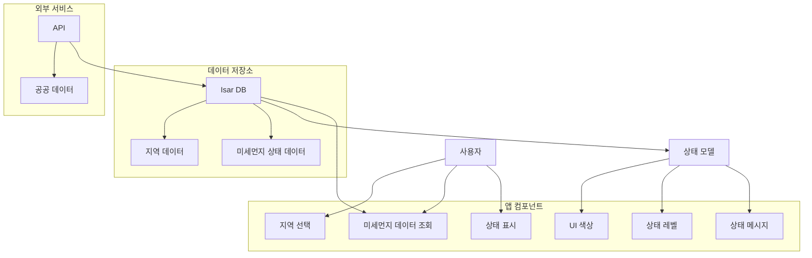

# 시스템 컨텍스트 다이어그램

```mermaid
graph TD
    A[사용자] --> B[지역 선택]
    A --> C[미세먼지 데이터 조회]
    A --> D[상태 표시]
    
    L[API] --> M[공공 데이터]
    L --> E[Isar DB]
    
    E --> F[지역 데이터]
    E --> G[미세먼지 상태 데이터]
    E --> H[상태 모델]
    E --> C[미세먼지 데이터 조회]
    
    H --> I[UI 색상]
    H --> J[상태 레벨]
    H --> K[상태 메시지]
    
    subgraph 앱 컴포넌트
        B
        C
        D
        I
        J
        K
    end
    
    subgraph 데이터 저장소
        E
        F
        G
    end
    
    subgraph 외부 서비스
        L
        M
    end
```
