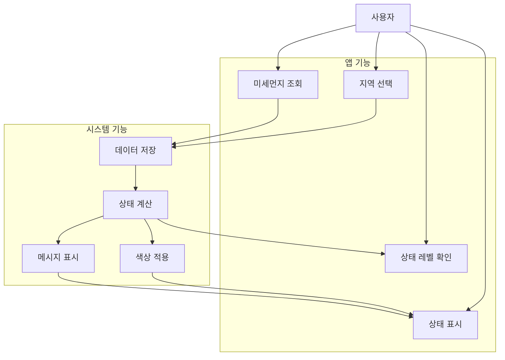

# 2. Use Case Analysis

## 2.1. Use Case Diagram

## 2.2. Use Case List

### Use Case ID와 이름

| Use Case ID | Korean Name | Actor |
|-------------|-------------|-------|
| #1 | 지역 선택 | 사용자 |
| #2 | API 데이터 가져오기 | 시스템 |
| #3 | 데이터 저장 | 시스템 |
| #4 | 미세먼지 상태 조회 | 사용자 |
| #5 | 상태 표시 | 사용자 |
| #6 | 상태 레벨 표시 | 사용자 |

## 2.3. Use Case Description

### 2.3.1. 지역 선택 (Use Case #1)
**GENERAL CHARACTERISTICS**
- **Summary**: 사용자가 원하는 지역을 선택하여 해당 지역의 미세먼지 정보를 확인
- **Scope**: Dustify
- **Level**: User level
- **Author**: System Developer
- **Last Update**: 2025-05-08
- **Status**: Under Review
- **Primary Actor**: 사용자
- **Secondary Actors**: Isar DB
- **Preconditions**: 앱이 실행 중인 상태
- **Trigger**: 메뉴에서 지역 선택 버튼 클릭
- **Success Post Condition**: 선택된 지역의 미세먼지 정보가 표시됨
- **Failed Post condition**: 선택된 지역이 없는 경우

**MAIN SUCCESS SCENARIO**
1. 사용자가 메뉴에서 지역 선택 버튼 클릭
2. 지역 선택 화면 표시
3. 사용자가 원하는 지역 선택
4. 선택된 지역의 미세먼지 정보 표시

**EXTENSION SCENARIOS**
- 2a. 지역이 선택되지 않은 경우
  - 메시지 표시: "지역을 선택해주세요"
  - 선택 화면 유지

### 2.3.2. API 데이터 가져오기 (Use Case #2)
**GENERAL CHARACTERISTICS**
- **Summary**: 공공 API에서 실시간 미세먼지 데이터를 가져옴
- **Scope**: Dustify
- **Level**: System level
- **Author**: System Developer
- **Last Update**: 2025-05-08
- **Status**: Under Review
- **Primary Actor**: 시스템
- **Secondary Actors**: 공공 API, Isar DB
- **Preconditions**: 인터넷 연결 상태
- **Trigger**: 주기적 API 호출
- **Success Post Condition**: 최신 미세먼지 데이터가 DB에 저장됨
- **Failed Post condition**: API 호출 실패 또는 인터넷 연결 문제

**MAIN SUCCESS SCENARIO**
1. 시스템이 주기적으로 API 호출
2. 공공 API에서 데이터 수신
3. 데이터 파싱 및 처리
4. Isar DB에 데이터 저장

**EXTENSION SCENARIOS**
- 2a. API 호출 실패
  - 에러 로그 기록
  - 이전 데이터 유지
  - 사용자 알림

### 2.3.3. 데이터 저장 (Use Case #3)
**GENERAL CHARACTERISTICS**
- **Summary**: API에서 가져온 데이터를 안정적으로 저장
- **Scope**: Dustify
- **Level**: System level
- **Author**: System Developer
- **Last Update**: 2025-05-08
- **Status**: Under Review
- **Primary Actor**: 시스템
- **Secondary Actors**: Isar DB
- **Preconditions**: API 데이터 수신 완료
- **Trigger**: API 데이터 수신
- **Success Post Condition**: 데이터가 Isar DB에 저장됨
- **Failed Post condition**: DB 저장 실패

**MAIN SUCCESS SCENARIO**
1. API 데이터 수신
2. 데이터 검증
3. Isar DB에 데이터 저장
4. 저장 성공 메시지

**EXTENSION SCENARIOS**
- 3a. 데이터 검증 실패
  - 에러 메시지 기록
  - 이전 데이터 유지

### 2.3.4. 미세먼지 상태 조회 (Use Case #4)
**GENERAL CHARACTERISTICS**
- **Summary**: 선택된 지역의 미세먼지 상태를 확인
- **Scope**: Dustify
- **Level**: User level
- **Author**: System Developer
- **Last Update**: 2025-05-08
- **Status**: Under Review
- **Primary Actor**: 사용자
- **Secondary Actors**: Isar DB, StatusModel
- **Preconditions**: 특정 지역이 선택된 상태
- **Trigger**: 지역 선택 완료
- **Success Post Condition**: 해당 지역의 미세먼지 상태가 표시됨
- **Failed Post condition**: 데이터 조회 실패

**MAIN SUCCESS SCENARIO**
1. 지역 선택 완료
2. Isar DB에서 데이터 조회
3. 상태 계산
4. 결과 표시

**EXTENSION SCENARIOS**
- 2a. 데이터 조회 실패
  - 이전 데이터 표시
  - 사용자 알림

### 2.3.5. 상태 표시 (Use Case #5)
**GENERAL CHARACTERISTICS**
- **Summary**: 미세먼지 상태에 따른 시각적 피드백 제공
- **Scope**: Dustify
- **Level**: User level
- **Author**: System Developer
- **Last Update**: 2025-05-08
- **Status**: Under Review
- **Primary Actor**: 사용자
- **Secondary Actors**: StatusModel
- **Preconditions**: 미세먼지 상태가 계산된 상태
- **Trigger**: 상태 변경
- **Success Post Condition**: 상태에 따른 색상과 메시지가 표시됨
- **Failed Post condition**: UI 업데이트 실패

**MAIN SUCCESS SCENARIO**
1. 상태 변경 감지
2. 색상 및 메시지 결정
3. UI 업데이트
4. 사용자 피드백

**EXTENSION SCENARIOS**
- 3a. UI 업데이트 실패
  - 이전 상태 유지
  - 사용자 알림

### 2.3.6. 상태 레벨 표시 (Use Case #6)
**GENERAL CHARACTERISTICS**
- **Summary**: 미세먼지 상태의 등급을 명확하게 표시
- **Scope**: Dustify
- **Level**: User level
- **Author**: System Developer
- **Last Update**: 2025-05-08
- **Status**: Under Review
- **Primary Actor**: 사용자
- **Secondary Actors**: StatusModel
- **Preconditions**: 미세먼지 상태가 계산된 상태
- **Trigger**: 상태 변경
- **Success Post Condition**: 상태 등급이 표시됨
- **Failed Post condition**: 상태 계산 실패

**MAIN SUCCESS SCENARIO**
1. 상태 변경 감지
2. 상태 레벨 계산
3. 레벨 표시
4. 사용자 피드백

**EXTENSION SCENARIOS**
- 2a. 상태 계산 실패
  - 기본 레벨 표시
  - 사용자 알림
